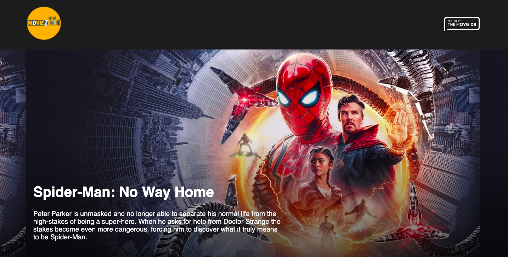
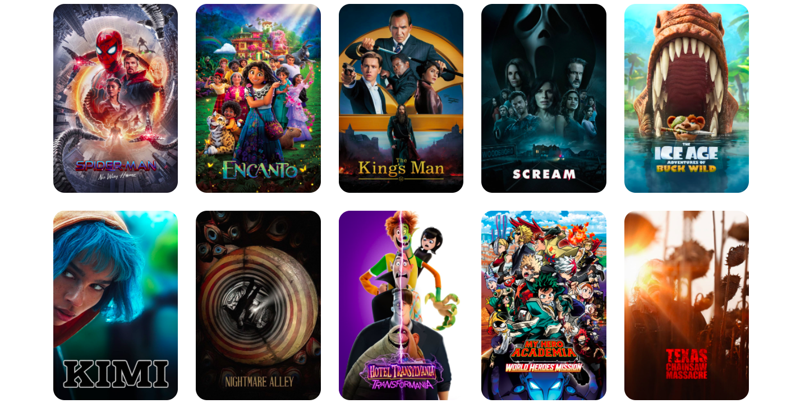

## REACT MOVIES-BOX APP WITH TYPESCRIPT

### Description: A nice react application , with typescript and JSX that affords users a lovely UI to view their favourite and choice movies, see characters, rating and details of the movies.

HOW TO USE

1. Clone the repo

2. Install dependencies

run yarn install

3. Start the development server

run yarn start

😊 What's Next?
This App will be constantly updated to include more features like

-view trailers.
-select favourite movies
